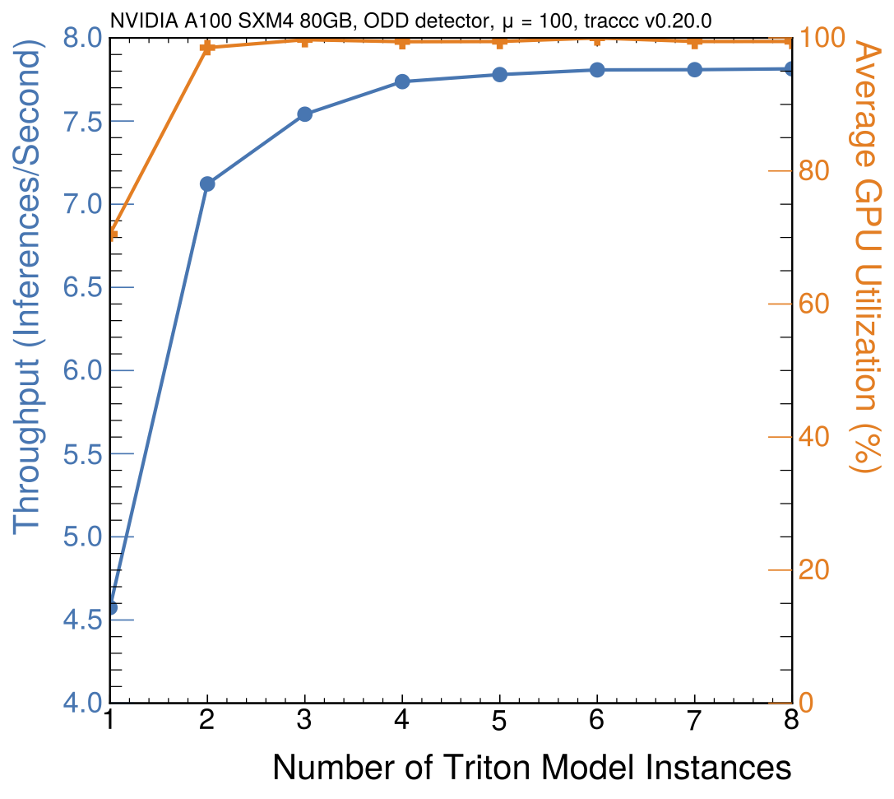
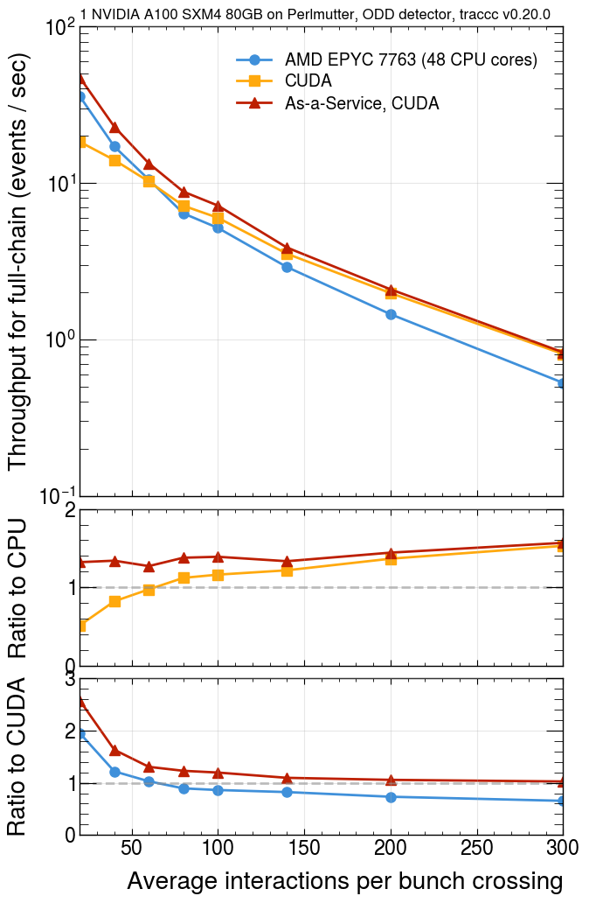

# `Traccc` as-a-service Performance Studies

This repository contains a set of scripts to analyze performance from the output of the `perf_analyzer` tool used to analyze performance of models using the NVIDIA triton server. These scripts are designed to analyze the performance of `traccc` as-a-service. The backend for this and instructions about getting the model can be found [in the traccc-aaS repository.](https://github.com/milescb/traccc-aaS). 

## Prerequisites
- NVIDIA Triton Inference Server
- Python 3.x with required packages
- CUDA-capable GPU
- Docker (for containerized deployment)
- kubectl (for Kubernetes deployment)

We have built an image that satisfies these requirements at `docker.io/milescb/triton-server:25.02-py3_gcc13.3`. 
You can pull this image at `nersc` with shifter via:

```
shifterimg pull milescb/triton-server:25.02-py3_gcc13.3
```

and run interactively with:

```
shifter --module=gpu --image=milescb/triton-server:25.02-py3_gcc13.3
```

## Quick Start
```bash
# Clone and setup
git clone git@github.com:milescb/traccc-aaS-performance.git
cd traccc-aaS-performance

# Run all tests
bash run.sh
``` 

## Repository delieverables:

The file `run.sh` creates all the plots we need for testing the standalone version of `traccc-aaS` including:

- Running the standalone `traccc` executable `thoughput_cuda_mt` and collecting data for CPU and GPU performance over a wide range of pileup values
- Running `traccc-aaS` over a wide range of pileup values. For each pileup value, inference is run for one model instance with one concurrent requests, up to eight model instances and eight concurrent requests
- Plotting a comparison of CPU and GPU throughput for standalone `traccc` as in
- Plotting throughput, GPU utilization, and latency for `traccc-aaS`, for instance with
<div style="display: flex; flex-wrap: wrap; justify-content: center;">
  
</div>

- Comparing throughput between standalone `traccc` and `traccc-aaS`
<div style="display: flex; flex-wrap: wrap; justify-content: center;">
  
</div>

## Step-by-step instructions

### Create input for `perf_analyzer`

Create input json file with 

```bash
python generate_json.py -i <input_file> -o <output_file>
```

### Performance Analyzer

Run `perf_analyzer` with the following:

```bash
perf_analyzer -m traccc-gpu --input-data $DATADIR/../test_data/test_perf_data.json
```

## Performance Plots

### Throughput as a function of concurrency

Run `perf_analyzer` with the CPU and GPU configuration

```bash
perf_analyzer -m traccc-gpu --input-data data/perf_data_odd_mu200.json \
    --concurrency-range <start>:<end>:<step> \
    --verbose-csv --collect-metrics \
    --measurement-interval 10000 \
    -f gpu_1instances.csv 
```

Then, we can make plots of throughput and GPU utlization with

```bash
python make_single_gpu_plots.py \
    --indir "data" \
    --title "ODD detector, μ = 200, traccc v0.23.0"
```

To expolore other plotting options, see python notebooks in the `notebooks` directory. 

### Compare CPU / GPU performance on `traccc` examples

First, make `.log` files containing the output of running the `traccc` examples via (for instance)

```
$INSTALLDIR/bin/traccc_seq_example_cuda \
    --use-detray-detector \
    --detector-file=$DATADIR/tml_detector/trackml-detector.csv \
    --digitization-file=$DATADIR/tml_detector/default-geometric-config-generic.json \
    --input-directory=$DATADIR/tml_full/ttbar_mu100 &> data/logs/gpu_mu100.log
```

then run the following to create the plot:

```
python compare_gpu_cpu_traccc.py
```

## Test k8 server performance

To run `perf_analyzer` on a k8 cluster such as nautilus, follow the instructions on setting up the server in [traccc-aas](https://github.com/milescb/traccc-aaS). Then, forward the gRPC port:

```
kubectl port-forward service/atlas-sonic 8001:8001 -n atlas-sonic
```

This avoids ssl authentication errors interfering with `perf_analyzer`. Then, run `perf_analyzer` as usual: 

```
data/nrp_inference_multi_gpu/ # if not already created
perf_analyzer -m traccc-gpu -i grpc \
    --input-data data/perf_data_odd_mu200.json --concurrency-range 1:20:1 \
    --measurement-interval 10000 -u localhost:8001 -r 30 \
    > data/nrp_inference_multi_gpu/out4gpu_1inst_take1.txt
```

Finally, to analyze the results, use the `multi_gpu_nautilus.ipynb` notebook. GPU performance metrics can be obtained through `Prometheus` which, at NRP, is accessible at `https://prometheus.nrp-nautilus.io`. All GPU metrics are prefixed with `nv_`. A few good metrics to analyzer are GPU utilization (`nv_gpu_utilization`), GPU power utilization (`nv_gpu_power_usage / nv_gpu_power_limit`), CPU utilization (`nv_cpu_utilization`), and the queue latency (`nv_inference_queue_duration_us / nv_inference_exec_count`). 

### !! Important !!

Do not forget to uninstall the remote server when done testing:

```
helm uninstall atlas-sonic -n atlas-sonic
```